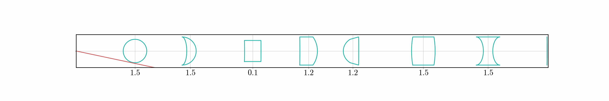

# Analytical Meridional Non-Paraxial Ray Propagation

This repositoriy contains a Python implementation for the analytical meridional non-paraxial ray propagation in optical systems. The code allows for the simulation and analysis of the behavior of optical rays as they pass through various lenses and surfaces.

For more information on the math and theory behind the implementation, please refer to the [paper](https://inspirehep.net/files/2b5cca16499156c122d1ac1970bfcded) or equivalently [`paper.pdf`](https://github.com/Noah-Everett/Analytical-Meridional-Non-Paraxial-Ray-Propagation/blob/main/paper.pdf).

(README syntax: `[]` denotes an optional argument, `<>` denotes a required argument)

## Installation

To use the code, you need to have Python installed on your system. Clone this repository to your local machine using the following command:

```
git clone -b <version name> [--depth 1] https://github.com/Noah-Everett/Analytical-Meridional-Non-Paraxial-Ray-Propagation.git
```

## Usage

The main functionality of the code is provided through the classes defined in `Src/`. You can import the necessary classes into your Python script or interactive session and use them to simulate the propagation of optical rays.

## Example Usage

```python
from ray_propagation import opticalRay, opticalSystem, rayPropagator

# Create an optical ray
ray = opticalRay(x=0, y=0, theta=0)

# Define the lenses and surfaces in the optical system
lens1 = lens(...)
lens2 = lens(...)
final_surface = surface(...)

# Create an optical system
system = opticalSystem([lens1, lens2], final_surface, refractiveIndices=[...])

# Create a ray propagator
propagator = rayPropagator(system, ray)

# Propagate the ray through the system
steps = propagator.propagateRay()

# Access the propagated ray at different steps
for step in steps:
    print(step.x, step.y, step.theta)
```

Please note that this is just a basic example to demonstrate the usage. You will need to define the actual parameters for lenses, surfaces, and refractive indices according to your specific optical system.

## Contributing

Contributions to this project are welcome. If you find any issues or have suggestions for improvements, please open an issue or submit a pull request.

## License

This project is licensed under the MIT License. See the [LICENSE](LICENSE) file for more information.